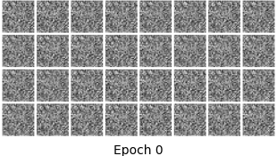
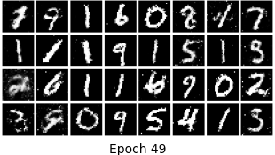
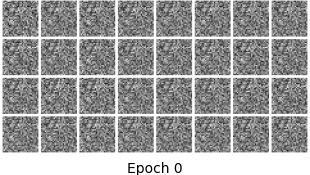
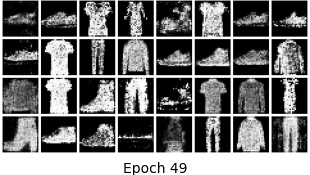
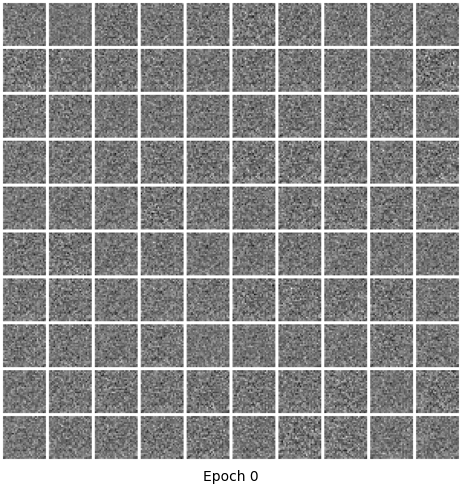
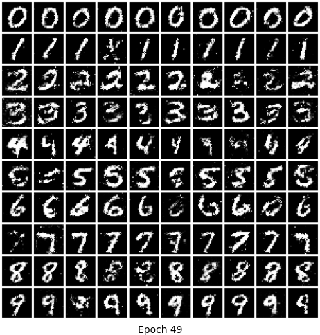
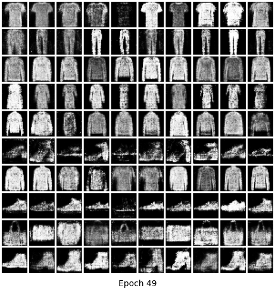
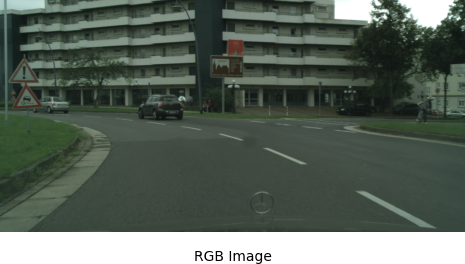
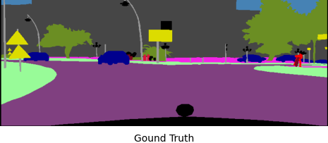
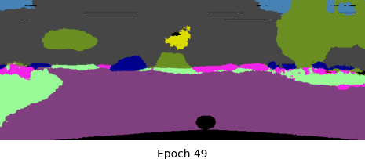

## Pytorch-minModel
This is the repository that holds my implementation for deep learning models. 

Note that this is mainly for educational purposes, so it only contains the minimum code for each model. As can be expected, the hyperparameters are not super optimized and the datasets used are the most accessible(smallest) ones.

##### Implemented :satisfied: 

Please refer to [this table](#training) for training details

- Generative Adversarial Networks: [GAN](#GANs), [cGAN](#cGANs), [DCGAN](#DCGANs)
- MLP-like architectures: TODO
- Convolutional Neural Networks: [U-net](#unet)
- Transformers: TODO


##### To be implemented :monocle_face:	
gMLP, ResNet, ViT, StyleGan, CR-GAN, cDC-GAN

## Quick start
To set up the right environment, run the following
```
pip install -r requirements.txt
```
(Optional) If you have an NVIDIA GPU, you can accelerate training by installing [CUDA](https://developer.nvidia.com/cuda-downloads/) and [cuDNN](https://developer.nvidia.com/cudnn) of the correct version.

Typically, one only needs to go to the folder for the desired model and run 
```
python train.py
```
Specific instructions will be provided in the "Implemented models" section, if needed.


## Implemented models

<a id="training">
  
| Model     | Trainable params       | Total size(MB)  | Training time(per epoch) | Dataset             | Batch size | GPU                  |
| :-------: | :--------------------: | :-------------: | :----------------------: | :-----------------: | :--------: | :------------------: |
| GAN(G+D)  | 566,273 + 298,640      | 2.19 + 1.17     | 10 seconds               | MNIST               | 128        | single NVIDIA 1070ti |
| cGAN(G+D) | 1,131,201 + 1,331,584  | 4.39 + 5.12     | 13 seconds               | MNIST               | 100        | single NVIDIA 1070ti |
| DCGAN(G+D)| 1,811,329 + 266,049    | 9.00 + 1.46     | 1 mintutes               | MNIST               | 128        | single NVIDIA 1070ti |
| U-net     | 31,033,955             | 4475.55         | 15 minutes               | Cityscapes          | 2          | single NVIDIA 1070ti |


- <i>Generative Adversarial Networks (GANs)</i><a id="GANs">
  - paper: https://arxiv.org/abs/1406.2661, 2014
  - author(s): Ian J. Goodfellow, Jean Pouget-Abadie, Mehdi Mirza, Bing Xu, David Warde-Farley, Sherjil Ozair, Aaron Courville, Yoshua Bengio
  - generated images from MNIST and Fashion-MNIST
  <p align="center">
  &nbsp;&nbsp;&nbsp;&nbsp;&nbsp;&nbsp;&nbsp;&nbsp;&nbsp;&nbsp;
  </p>
    <p align="center">
  &nbsp;&nbsp;&nbsp;&nbsp;&nbsp;&nbsp;&nbsp;&nbsp;&nbsp;&nbsp;
  </p>
  
  
- <i>Conditional Generative Adversarial Networks (cGANs)</i><a id="cGANs">
  - paper: https://arxiv.org/abs/1411.1784, 2014
  - author(s): Mehdi Mirza, Simon Osindero
  - generated images from MNIST and Fashion-MNIST
  <p align="center">
  &nbsp;&nbsp;&nbsp;&nbsp;&nbsp;&nbsp;&nbsp;&nbsp;&nbsp;&nbsp;
  </p>
  <p align="center">
  &nbsp;&nbsp;&nbsp;&nbsp;&nbsp;&nbsp;&nbsp;&nbsp;&nbsp;&nbsp;
  </p>

 - <i>Deep Convolutional Generative Adversarial Networks (DCGANs)</i><a id="DCGANs">
   - paper: https://arxiv.org/abs/1511.06434, 2015
   - author(s): Alec Radford, Luke Metz, Soumith Chintala
   - generated images from MNIST and Fashion-MNIST
  
  
  
- <i>U-net</i><a id="unet">
  - paper: https://arxiv.org/pdf/1505.04597.pdf, 2015
  - author(s): Olaf Ronneberger, Philipp Fischer, and Thomas Brox
  - semantic segmentation on Cityscape (not fully trained due to resource constraints unfortunately)
  - The input RGB image has larger spatial size than the output mask due to the unpadded convolution in Unets
   <p align="center">
    &nbsp;&nbsp;&nbsp;&nbsp;&nbsp;&nbsp;&nbsp;&nbsp;&nbsp;&nbsp;
    
  </p>
  <p align="center">
    &nbsp;&nbsp;&nbsp;&nbsp;&nbsp;&nbsp;&nbsp;&nbsp;&nbsp;&nbsp;
    
  </p>
