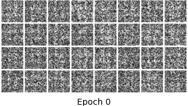
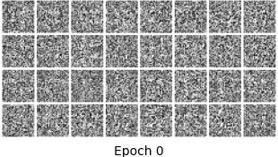
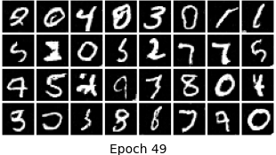
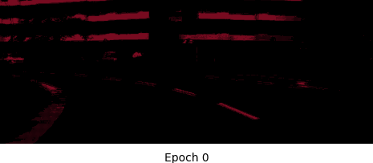

## Pytorch-minModel
This is the repository that holds my implementation for deep learning models. 

Note that this is mainly for educational purposes, so it only contains the minimum code for each model. As can be expected, the hyperparameters are not super optimized and the datasets used are the most accessible(smallest) ones.

##### Implemented :satisfied: 

Please refer to [this table](#training) for training details

- Generative Adversarial Networks: [GAN](#GANs), [cGAN](#cGANs), [DCGAN](#DCGANs), [CRGAN](#CRGANs), [WGAN-gp](#WGAN-gp), [3D-DCGAN](#3DDCGANs)
- MLP-like architectures: TODO
- Convolutional Neural Networks: [U-net](#unet)
- Transformers: TODO


##### To be implemented :monocle_face:	
gMLP, ResNet, ViT, StyleGan, WGAN, SNGAN, Unet++

## Quick start
To set up the right environment, run the following
```
pip install -r requirements.txt
```
(Optional) If you have an NVIDIA GPU, you can accelerate training by installing [CUDA](https://developer.nvidia.com/cuda-downloads/) and [cuDNN](https://developer.nvidia.com/cudnn) of the correct version.

Typically, one only needs to go to the folder for the desired model and run 
```
python train.py
```
Specific instructions will be provided in the "Implemented models" section, if needed.


## Implemented models

<a id="training">
  
| Model          | Trainable params         | Total size(MB)  | Training time(per epoch) | Dataset             | Batch size | GPU                  |
| :------------: | :----------------------: | :-------------: | :----------------------: | :-----------------: | :--------: | :------------------: |
| GAN(G+D)       | 566,273 + 298,640        | 2.19 + 1.17     | 10s                      | MNIST               | 128        | 1x NVIDIA 1070ti     |
| cGAN(G+D)      | 1,131,201 + 1,331,584    | 4.39 + 5.12     | 13sec                    | MNIST               | 100        | 1x NVIDIA 1070ti     |
| DCGAN(G+D)     | 1,811,329 + 266,049      | 9.00 + 1.46     | 1min                     | MNIST               | 128        | 1x NVIDIA 1070ti     |
| CRGAN(G+D)     | 1,811,329 + 266,049      | 9.00 + 1.46     | 1min 5sec                | MNIST               | 128        | 1x NVIDIA 1070ti     |
| WGAN-gp(G+C)   | 1,811,329 + 304,065      | 9.00 + 1.61     | 1min 10sec               | MNIST               | 128        | 1x NVIDIA 1070ti     |
| 3D-DCGAN(G+D)  | 53,772,641 + 2,643,265   | 336.13 + 18.96  | 8min                     | 64^3 cube ShapeNet  | 16         | 1x NVIDIA 1070ti     |
| U-net          | 31,033,955               | 4475.55         | 15min                    | Cityscapes          | 2          | 1x NVIDIA 1070ti     |

  
- <i>3D Deep Convolutional Generative Adversarial Networks (3D-DCGANs)</i><a id="3DDCGANs">
  - Paper: Learning a Probabilistic Latent Space of Object Shapes via 3D Generative-Adversarial Modeling, https://arxiv.org/abs/1910.12027, 2017
  - Author(s): Jiajun Wu, Chengkai Zhang, Tianfan Xue, William T. Freeman, Joshua B. Tenenbaum
  - Many thanks to Xingchang Huang for making his dataset code publicly available, here's the [link](https://github.com/xchhuang/simple-pytorch-3dgan) to the repo
  - To train the model: 
     - Download the data from Xingchang's repo, 
     - Create a "ShapeNet_Chair" folder inside the datasets folder
     - Move the data inside the "ShapeNet_Chair" folder
     - Run train.py
   - Training tricks:
     - Consistency regularization(CR) on the output
     - Discriminator trains for 2 iterations per generator update
     - Discriminator only updates when its accuracy is below a threshold
   - Best shapes generated within 100 epochs (left: CR=0; right: CR=1)
   <p align="center">
    &nbsp;&nbsp;&nbsp;&nbsp;&nbsp;&nbsp;&nbsp;&nbsp;&nbsp;&nbsp;
    
   </p>

  
- <i>Wasserstein Generative Adversarial Networks with gradient penalty (WGAN-gp)</i><a id="WGAN-gp">
  - Paper 1: Wasserstein GAN, https://arxiv.org/abs/1701.07875, 2017
  - Author(s): Martin Arjovsky, Soumith Chintala, Léon Bottou
  - Paper 2: Improved Training of Wasserstein GANs, https://arxiv.org/abs/1704.00028, 2017
  - Author(s): Ishaan Gulrajani, Faruk Ahmed, Martin Arjovsky, Vincent Dumoulin, Aaron Courville
  - Here are some of my observations when training the models (on MNIST dataset only)
    - With gradient penalty, Critic's gradient norm did get closer to 1 , but the image quality did not improve (maybe weaker penalty would help, marked a to-do experiment)
    - Layer norm did a better job in regularizing Critic's gradient norm than batch norm
    - When using batch norm in the Critic, the model seemed to generate higher quality image
    - The model generated relatively poor quality images without any normalization in the Critic
  
  - Generated images from MNIST with different penalty coefficients (λ) and normalizations in the Critic
    - Layer normalization, as the authors recommended in the second paper(top λ=0, bottom λ=10)
    <p align="center">
    &nbsp;&nbsp;&nbsp;&nbsp;&nbsp;&nbsp;&nbsp;&nbsp;&nbsp;&nbsp;
    </p>
    <p align="center">
    &nbsp;&nbsp;&nbsp;&nbsp;&nbsp;&nbsp;&nbsp;&nbsp;&nbsp;&nbsp;
    </p>
  
    - Batch normalization (top λ=0, bottom λ=10)
    <p align="center">
    &nbsp;&nbsp;&nbsp;&nbsp;&nbsp;&nbsp;&nbsp;&nbsp;&nbsp;&nbsp;
    </p>  
     <p align="center">
    &nbsp;&nbsp;&nbsp;&nbsp;&nbsp;&nbsp;&nbsp;&nbsp;&nbsp;&nbsp;
    </p>   
    
    - None (λ=10)
    <p align="center">
    &nbsp;&nbsp;&nbsp;&nbsp;&nbsp;&nbsp;&nbsp;&nbsp;&nbsp;&nbsp;
    </p>  
  
- <i>Consistency Regularized Generative Adversarial Networks (CRGANs)</i><a id="CRGANs">
   - Paper: Consistency Regularization for Generative Adversarial Networks, https://arxiv.org/abs/1910.12027, 2019
   - Author(s): Han Zhang, Zizhao Zhang, Augustus Odena, Honglak Lee
   - Generated images from MNIST and Fashion-MNIST
   <p align="center">
   &nbsp;&nbsp;&nbsp;&nbsp;&nbsp;&nbsp;&nbsp;&nbsp;&nbsp;&nbsp;
   </p>
   <p align="center">
   &nbsp;&nbsp;&nbsp;&nbsp;&nbsp;&nbsp;&nbsp;&nbsp;&nbsp;&nbsp;
   </p>

  
- <i>Conditional Generative Adversarial Networks (cGANs)</i><a id="cGANs">
  - paper: Conditional Generative Adversarial Networks, https://arxiv.org/abs/1411.1784, 2014
  - author(s): Mehdi Mirza, Simon Osindero
  - generated images from MNIST and Fashion-MNIST
  <p align="center">
  &nbsp;&nbsp;&nbsp;&nbsp;&nbsp;&nbsp;&nbsp;&nbsp;&nbsp;&nbsp;
  </p>
  <p align="center">
  &nbsp;&nbsp;&nbsp;&nbsp;&nbsp;&nbsp;&nbsp;&nbsp;&nbsp;&nbsp;
  </p>

  
 - <i>Deep Convolutional Generative Adversarial Networks (DCGANs)</i><a id="DCGANs">
   - Paper: Deep Convolutional Generative Adversarial Networks, https://arxiv.org/abs/1511.06434, 2015
   - Author(s): Alec Radford, Luke Metz, Soumith Chintala
   - generated images from MNIST and Fashion-MNIST
   <p align="center">
   &nbsp;&nbsp;&nbsp;&nbsp;&nbsp;&nbsp;&nbsp;&nbsp;&nbsp;&nbsp;
   </p>
   <p align="center">
   &nbsp;&nbsp;&nbsp;&nbsp;&nbsp;&nbsp;&nbsp;&nbsp;&nbsp;&nbsp;
   </p>
  
  
- <i>Generative Adversarial Networks (GANs)</i><a id="GANs">
  - Paper: Generative Adversarial Nets, https://arxiv.org/abs/1406.2661, 2014
  - Author(s): Ian J. Goodfellow, Jean Pouget-Abadie, Mehdi Mirza, Bing Xu, David Warde-Farley, Sherjil Ozair, Aaron Courville, Yoshua Bengio
  - generated images from MNIST and Fashion-MNIST
  <p align="center">
  &nbsp;&nbsp;&nbsp;&nbsp;&nbsp;&nbsp;&nbsp;&nbsp;&nbsp;&nbsp;
  </p>
  <p align="center">
  &nbsp;&nbsp;&nbsp;&nbsp;&nbsp;&nbsp;&nbsp;&nbsp;&nbsp;&nbsp;
  </p>
  
  
- <i>U-net</i><a id="unet">
  - Paper: https://arxiv.org/pdf/1505.04597.pdf, 2015
  - Author(s): Olaf Ronneberger, Philipp Fischer, and Thomas Brox
  - Semantic segmentation on Cityscape (not fully trained due to resource constraints unfortunately)
  - The input RGB image has larger spatial size than the output mask due to the unpadded convolution in Unets
   <p align="center">
    &nbsp;&nbsp;&nbsp;&nbsp;&nbsp;&nbsp;&nbsp;&nbsp;&nbsp;&nbsp;
    
  </p>
  <p align="center">
    &nbsp;&nbsp;&nbsp;&nbsp;&nbsp;&nbsp;&nbsp;&nbsp;&nbsp;&nbsp;
    
  </p>  
